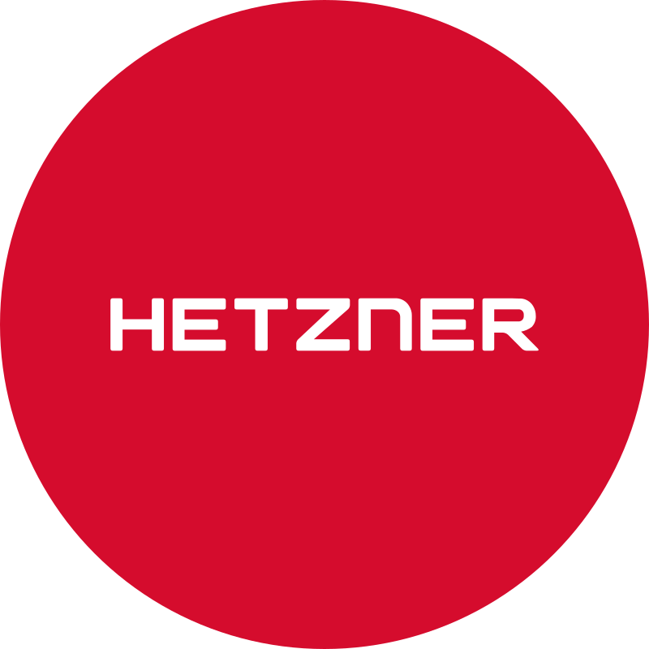

### My Technology Stack

| Category | Tools & Technologies |
|-----------|----------------------|
| **Cloud Services** |     |
| **Scripting** |   |
| **Containers** |   |
| **Version Control** |    |
| **Automation** |        |
| **Infrastructure as Code** |     |
| **Message Brokers** |   |
| **Databases** |    |
| **Web Servers & Proxies** |     |
| **Observability** |     |
| **Sysadmin** |  |
| **Virtualization** |   |
